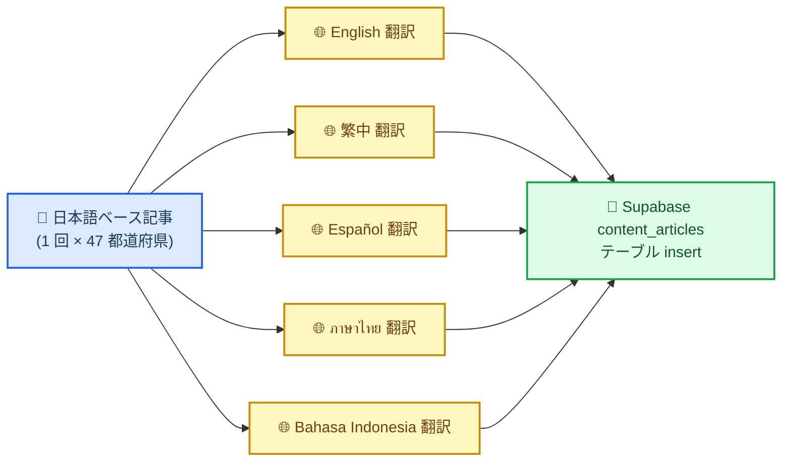
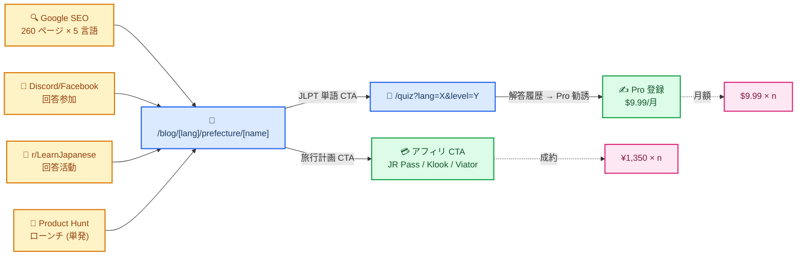

# 47 都道府県コンテンツ × Haiku 4.5 プロンプト設計 v2

> **v2 変更点**（2026-04-22 D18 決定）:
> - 自前 YouTube（Jepang Menarik）連動機能を**削除**（ROI 劣悪のため不採用）
> - プロンプト C（インドネシア語 + YouTube CTA）を**廃止**
> - `content_articles` テーブルの `youtube_url_id` カラムを**削除**
> - 5 言語均等展開を維持（id 優先案は棄却）

## 🎯 目的と制約

### 何を作るか
- 日本 47 都道府県 × 5 言語（en / zh / es / th / id）= **235 記事**（+ ja ベース記事 47 = **282 記事**）
- 1 記事 = 「地方文化 + 歴史 + 旅行ハイライト + JLPT 重要単語 5 語 + アフィリ導線 + 学習 CTA」
- SEO 最適化（title / meta / h1 / h2 / hreflang）
- **Jepang Menarik YouTube チャンネル（インドネシア語）**との連動ファネル

### 制約
| 項目 | 値 | 根拠 |
|---|---|---|
| モデル | Haiku 4.5 (`claude-haiku-4-5-20251001`) | 既存インフラ流用、コスト最安 |
| 出力長 | 2,500 tok/記事 | max_tokens=2500、仕様書 §9 の延長 |
| 全体コスト | 282 記事 × 2,500 tok × $5/MTok (out) = **$3.53** | 翻訳込みの純 API コスト |
| 生成時間 | 282 × 1.5 秒 = **~7 分**（並列化なし） | Vercel Hobby 60 秒制約 → バッチ分割必須 |
| 品質保証 | 人間レビュー 10 分/記事 × 47 = **8h** | 日本語版のみ、翻訳版はサンプルレビュー |

---

## 🏗️ コンテンツ構造（言語共通）

```
記事テンプレート
├── 1. フロントマター（SEO メタデータ）
│   ├── title (60 字以内、言語別、都道府県 + 関心フック)
│   ├── description (150 字以内、言語別)
│   ├── slug (/blog/[lang]/prefecture/[prefecture-slug])
│   ├── hreflang (5 言語のクロスリンク)
│   └── published_at / updated_at
│
├── 2. H1: 都道府県名 + サブタイトル
│
├── 3. 冒頭フック（1 段落、100 字）
│   └── 読者の好奇心を捕捉、「次を読みたい」気持ち
│
├── 4. 地方文化セクション（H2 + 200-300 字）
│   ├── 代表的な食文化
│   ├── 祭り・伝統
│   └── 方言・言葉の特徴（日本語学習者向けに重要）
│
├── 5. 歴史セクション（H2 + 200-300 字）
│   ├── 重要な歴史上の出来事（既知事実のみ）
│   └── 現代への影響
│
├── 6. 旅行ハイライト（H2 + 250-350 字）
│   ├── 必見スポット 3 箇所
│   ├── ベストシーズン
│   └── アクセス（新幹線 / 空港）
│      💡 アフィリ導線ポイント 1: JR Pass（新幹線利用で言及）
│
├── 7. JLPT 重要単語 5 語（H2 + テーブル）
│   ├── 日本語 | ふりがな | 意味（言語別）| 例文（日本語）| 例文訳
│   └── JLPT レベルは都道府県の代表的文化語から選定（例: 北海道→N4「雪祭り」）
│
├── 8. 学習アクション CTA（H2 + 100 字）
│   ├── NihongoHub クイズへの誘導（言語別・レベル別）
│   └── "Try a free quiz about [prefecture] words"
│
├── 9. 旅行ツール比較（H2 + 150 字）
│   💡 アフィリ導線ポイント 2: JR Pass + Klook or Viator（地域別）
│
└── 10. 関連記事（H3 + 内部リンク 3-5 本）
    └── 隣接都道府県 + 同テーマ（文化・歴史・旅行）
```

---

## 🤖 Haiku 4.5 プロンプト設計

### 2 段階生成方式（推奨）



**なぜ 2 段階か**:
- 1 回ですべての言語を生成すると記事品質が言語ごとにばらつく
- ベース記事を日本語で作り切ってから翻訳することで **事実整合性**と**文化的正確性**を確保
- 翻訳プロンプトは短くできる（ベースを参照するだけ）→ API コスト削減

### プロンプト A: 日本語ベース記事生成

```text
あなたは日本の地域文化に詳しいライターです。以下の都道府県について、
海外の日本語学習者（JLPT N5–N2）が読みたくなる記事を書いてください。

都道府県: {prefecture_name_ja}
都道府県 romaji: {prefecture_slug}

厳守ルール:
1. 著作権: JNTO、Wikipedia、japanticket.com、JR 東日本などの公式文言を複製しない。
   オリジナルの表現で書く。
2. 事実確度: 広く知られた事実のみ記述。マイナーな歴史事件は書かない。
   不明な場合は「[REQUIRES_FACTCHECK]」と明記して人間レビューに委ねる。
3. 具体性: 「美しい自然」「魅力的な文化」等の曖昧表現は禁止。
   具体的な地名・食・行事・人物を必ず出す。
4. 学習者視点: JLPT 対象語彙を意識。N3 レベルの漢字に適宜ふりがな。
5. 長さ: 合計 1,200–1,500 字（日本語）。

以下の JSON 構造のみで返答:
{
  "title": "都道府県名 + 関心フック（30 字以内）",
  "hook": "冒頭フック 1 段落（100 字）",
  "culture": {
    "food": "食文化 80 字",
    "festival": "祭り・伝統 80 字",
    "dialect_or_language": "方言・言語特徴 60 字"
  },
  "history": {
    "key_event": "重要な歴史 120 字",
    "modern_impact": "現代への影響 80 字"
  },
  "travel": {
    "spots": ["スポット 1 (50 字)", "スポット 2 (50 字)", "スポット 3 (50 字)"],
    "best_season": "30 字",
    "access": "40 字（JR 新幹線または空港から）"
  },
  "jlpt_words": [
    {
      "word": "日本語単語",
      "reading": "ふりがな",
      "meaning_ja": "日本語での意味",
      "example_ja": "例文 15-25 字",
      "jlpt_level": "N5|N4|N3|N2"
    }
    // 合計 5 語
  ],
  "affiliate_hooks": {
    "train_context": "新幹線・在来線での旅の魅力 40 字（JR Pass への自然な導線）",
    "activity_context": "現地体験の魅力 40 字（Klook/Viator への自然な導線）"
  }
}
```

### プロンプト B: 言語別翻訳 + SEO 最適化

```text
以下の日本語記事を {target_language_name} に翻訳し、
SEO メタデータを最適化してください。

対象言語: {target_language_name} ({target_language_code})
対象読者: JLPT N5–N2 レベルの日本語学習者（{target_language_name} ネイティブ）

入力記事（日本語 JSON）:
{japanese_base_article_json}

翻訳ルール:
1. 逐語訳ではなく、{target_language_name} ネイティブにとって自然な表現に。
2. 日本語の単語（jlpt_words）は翻訳しない。reading と example_ja も保持。
   meaning_ja を meaning_{target_language_code} に翻訳。
   example_translation に例文の翻訳を追加。
3. 固有名詞（都道府県名、地名）は現地表記を優先:
   - en: Tokyo, Osaka
   - zh: 東京, 大阪（繁体）
   - es: Tokio, Osaka
   - th: โตเกียว, โอซาก้า
   - id: Tokyo, Osaka
4. SEO タイトル: 60 字以内、主要キーワード前寄せ
5. SEO メタディスクリプション: 150 字以内、CTA 含む

以下の JSON 構造のみで返答:
{
  "seo": {
    "title_{lang}": "SEO タイトル",
    "description_{lang}": "メタディスクリプション",
    "slug": "(日本語ベースと同じ、変更しない)"
  },
  "hook_{lang}": "翻訳",
  "culture_{lang}": { "food": "...", "festival": "...", "dialect_or_language": "..." },
  "history_{lang}": { "key_event": "...", "modern_impact": "..." },
  "travel_{lang}": { "spots": ["...", "...", "..."], "best_season": "...", "access": "..." },
  "jlpt_words_{lang}": [
    {
      "word": "(日本語維持)",
      "reading": "(日本語維持)",
      "meaning_{lang}": "翻訳",
      "example_ja": "(日本語維持)",
      "example_translation_{lang}": "例文の翻訳",
      "jlpt_level": "(維持)"
    }
  ],
  "affiliate_hooks_{lang}": {
    "train_context": "翻訳",
    "activity_context": "翻訳"
  },
  "cta_{lang}": "学習 CTA 一文（'Try a free quiz...' 相当、言語文化適応）"
}
```

### ~~プロンプト C: YouTube 連動~~ (v2 で削除)

自前 YouTube（Jepang Menarik、100 登録者）の ROI が月 100 万円目標に対して 0.2% 未満と試算されたため、コンテンツへの連動は **v2 で廃止**。インドネシア語プロンプトは他 4 言語と同一仕様。

---

## 💰 コスト詳細試算

### プロンプト A（日本語ベース、47 本）
- 入力: ~500 tok × 47 = 23,500 tok → $0.024
- 出力: ~1,500 tok × 47 = 70,500 tok → $0.353
- 小計: **$0.38**

### プロンプト B（翻訳、47 × 5 = 235 本）
- 入力: ~1,800 tok（ベース記事含む）× 235 = 423,000 tok → $0.42
- 出力: ~1,500 tok × 235 = 352,500 tok → $1.76
- 小計: **$2.18**

### 合計: **$2.56**（予備 40% で $3.6 見積、仕様書の $2.35 見積と整合）

---

## 🎯 集客ファネル（YouTube なし、v2）



---

## 🏢 データベーススキーマ拡張（Phase C2）

`supabase/schema.sql` に追加予定:

```sql
CREATE TABLE IF NOT EXISTS content_articles (
  id UUID PRIMARY KEY DEFAULT gen_random_uuid(),
  prefecture_slug TEXT NOT NULL,
  prefecture_name_ja TEXT NOT NULL,
  lang TEXT NOT NULL CHECK (lang IN ('ja','en','zh','es','th','id')),
  title TEXT NOT NULL,
  description TEXT,
  content_json JSONB NOT NULL,
  human_reviewed_at TIMESTAMPTZ,
  published_at TIMESTAMPTZ,
  updated_at TIMESTAMPTZ DEFAULT now(),
  UNIQUE (prefecture_slug, lang)
);

CREATE INDEX IF NOT EXISTS idx_content_articles_lang
  ON content_articles (lang, published_at DESC);
```

---

## 🧪 品質保証プロセス

### Phase 1: 自動生成直後（全 282 記事）
- `[REQUIRES_FACTCHECK]` マーカーの有無を grep → マーカー入り記事をレビュー対象に
- JSON 構造バリデーション（必須フィールド存在、文字数上限）
- 固有名詞スペルチェック（都道府県名、主要地名）

### Phase 2: 人間レビュー（日本語 47 記事、各 10 分 = 8h）
- オーナーが日本語ベース記事を読んで事実誤り訂正
- 特に「歴史セクション」は事実確度要注意
- 必要に応じて再生成（単一記事の再生成は $0.01）

### Phase 3: 翻訳サンプリング（各言語 5 記事ずつ × 5 = 25 記事）
- 可能なら各言語ネイティブレビュアー（Fiverr / Upwork 経由、1 記事 $2–5）
- 自信あるインドネシア語のみオーナーがチェック（Jepang Menarik 運営経験）

### Phase 4: 公開後モニタリング
- Vercel Analytics で直帰率・滞在時間
- 直帰率 70% 超の記事は再生成候補

---

## 📅 Phase C2 実行スケジュール（2026-06-15 〜 2026-07-15）

| 週 | タスク | 工数 |
|---|---|---|
| W1 (6/15-21) | DB スキーマ追加 + プロンプト実装スクリプト作成 | 4h |
| W2 (6/22-28) | 日本語ベース 47 記事生成 + オーナーレビュー（25 記事） | 6h |
| W3 (6/29-7/5) | オーナーレビュー残り 22 記事 + 翻訳バッチ 235 記事生成 | 5h |
| W4 (7/6-12) | 翻訳サンプリングレビュー + Supabase 投入 + SEO 確認 | 5h |
| W5 (7/13-15) | Jepang Menarik 動画 URL 連携 + 公開 + 初期モニタリング | 3h |

**合計 23h = 2h × 約 12 日（Phase C2 の 1 ヶ月枠の半分）**

---

## ✅ 確定事項（2026-04-22 D18 最終判断）

1. **5 言語均等展開** — id 優先案は棄却
2. **自前 YouTube（Jepang Menarik 100 登録者）は活用しない** — ROI が SEO の 1/100 のため
3. **主軸は SEO 260 ページ**（47 × 5 + 25 LP）で月 100K–200K 流入を目指す
4. **補助**: Discord 回答参加 + Product Hunt 単発ローンチ + r/LearnJapanese 回答
5. **アフィリ登録**: Phase C2 完了後（トラフィック 1,000+/月 到達時点）

---

## 🔗 成果物リスト（Phase C2 完了時）

- `content-pipeline/prompts/base-ja.txt` — プロンプト A テンプレ
- `content-pipeline/prompts/translate-[lang].txt` × 5 — プロンプト B
- `content-pipeline/generate-content.mjs` — バッチ生成スクリプト
- `content-pipeline/prefecture-list.json` — 47 都道府県メタデータ（slug, 日本語名, 地方区分）
- `supabase/migrations/2026-06-content_articles.sql` — スキーマ追加
- Supabase: `content_articles` テーブル 282 行投入
