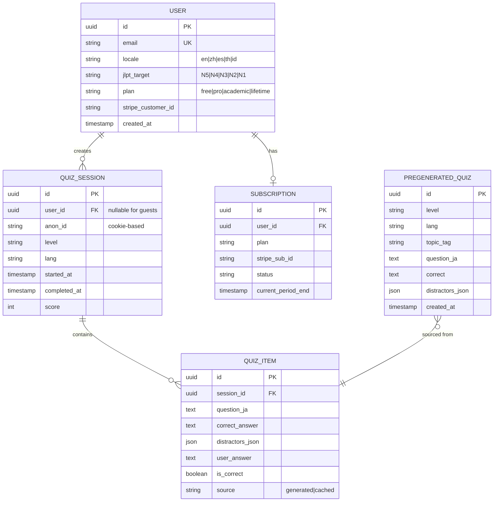
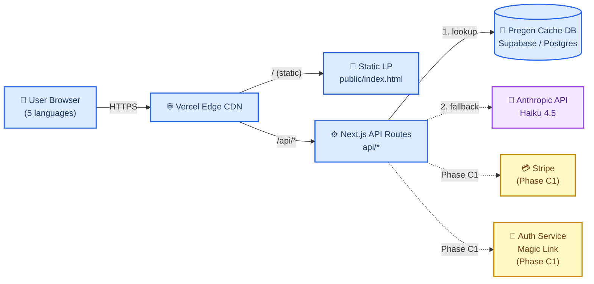
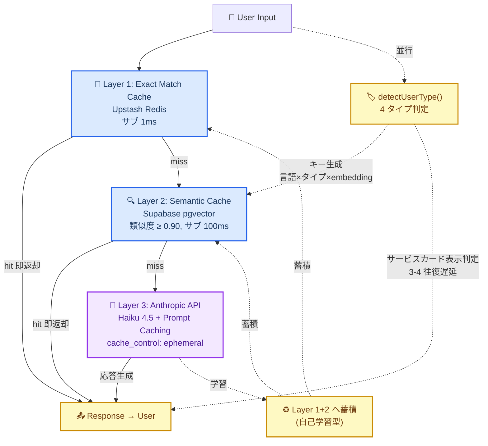

# NihongoHub サイト仕様書 v1

> **v1 のスコープ**: Phase B 受け入れ基準を通すための最小必要十分版。認証・DB・法務・SEO は Phase B デプロイと並走で決める（v1.5 追記）。
>
> **差別化の骨子**（競合調査より）: 非英語圏 5 言語 LP × Haiku 4.5 原創問題 × $9.99 中価格（= Migaku の半額）。競合が空白の象限を取りに行く。
>
> **🆕 2026-04-30 夜 戦略反転採択** (詳細: [`notes/2026-04-30-decisions.md`](../../notes/2026-04-30-decisions.md) 決定 6 / [`strategic-review-2026-04-30.md`](./strategic-review-2026-04-30.md)):
> 1. **Free Trial 型移行** (Pro 転換率 2% → 17-49% 想定、EdTech 業界 Opt-in trial 17.8% / Opt-out trial 49.9%)
> 2. **3 言語ファースト** (繁中 + インドネシア + 英語、JLPT Top 10 順位ベース。スペイン・タイは AI 翻訳のみで Phase D 後送り)
> 3. **SRS 機能を Phase C1 スコープに正式追加** (Bunpro/jpdb との競争優位、SLA 学術エビデンス: kanji 90 日 +37% retention)
> 4. **ミニチャット入口 + 3 層モダンキャッシュは §12 Phase B 受入基準から外し、Phase C1 後送り** (Phase B 集中枠の侵食回避、Migaku Patreon 離脱の前例警告と整合)
> 5. **生活ハンドブック単発 PDF 固定 + 販売開始 6/14 前倒し** (新 Specified Residence Card 発行ピーク捕捉、行政書士法業務性回避)

---

## 🎯 1. プロダクト定義

### ビジョン
英語圏以外の日本語学習者に、**安価で無尽蔵な JLPT 練習環境** を提供する。

### ミッション
Anthropic Haiku 4.5 による原創問題生成と 5 言語 UI で、JLPT 受験者の **母語による学習** を可能にする。

### ターゲットペルソナ（⚠️ 全て未検証仮説 — Phase B 直後の Discord 10 人インタビューで検証）
| ペルソナ | 属性 | ニーズ | 競合代替 | 検証ステータス |
|---|---|---|---|---|
| **A: タイ・インドネシアの大学生** | 20 代前半、JLPT N4–N3 受験目標、月間学習予算 ¥500 以下 | 母語で解説される JLPT 模試、ネット環境に依存しない軽量 UI | Migii JLPT（広告多）/ Bunpro（英語のみ） | 🟡 未検証 |
| **B: ラテンアメリカ在住のアニメファン** | 20–30 代、スペイン語ネイティブ、JLPT N5–N4、趣味学習 | スペイン語で日本語を学べる、気軽に試せる | Duolingo（浅い）/ Renshuu（英語のみ） | 🟡 未検証 |
| **C: 台湾・香港の社会人学習者** | 30 代、ビジネス日本語志向、N2 受験、月 $20 まで支払可 | 繁中で解説される練習問題、プロ品質 | NativShark（高価、英語）/ Bunpro（英語） | 🟡 未検証 |

**検証プロトコル**: [persona-interview-template.md](./persona-interview-template.md) に準拠、Discord 各言語圏 3–4 人 × 15 分で実施。

### コアバリュー提案（エレベーターピッチ）
> "JLPT の練習問題を、あなたの母語で、無尽蔵に。$9.99/月。"

### 対象言語（5 言語）
英語 (en) / 繁体中国語 (zh) / スペイン語 (es) / タイ語 (th) / インドネシア語 (id)

### スコープ外（やらないこと）
- 会話練習（Busuu・Migaku の領域）
- 漢字書き順アニメ（WaniKani・Kanji Study の領域）
- 動画教材（Migaku の領域）
- JLPT 公式過去問の転載（著作権リスク回避）

---

## 🧩 2. 機能スコープ（MVP vs Full）

### MVP（Phase B で公開 — 既実装）
- ✅ 5 言語切替の LP（`public/index.html`）
- ✅ AI クイズ生成 API（`/api/generate`、Haiku 4.5）
- ✅ ヘルスチェック（`/api/health`）

### Phase B 追加必須（デプロイ前）
- [ ] **プリ生成キャッシュ**: 5 言語 × 5 レベル × 100 問 = 2,500 問を起動時に事前生成（競合調査の最大リスク対策）
- [ ] **ゲスト日次リミット**: 10 問/日/IP（API 爆発防止）
- [ ] **Vercel Analytics 有効化**
- [ ] **🆕 LP ヒーロー直下のミニチャット入口（2026-04-30 追加、外部 LLM 提案 1st 部分採用）**: 3 層モダンキャッシュ構造で実装、詳細は §6-BIS 参照

### Phase C1（収益化、2026-06-15 期限 → 一部 2026-06-14 前倒し）
- [ ] ユーザー認証（7 節で詳細、v1.5）
- [ ] **🆕 Free Trial 型実装** (Pro $9.99 で 3-7 日全機能解放、終了時自動課金 / opt-in 推奨、Stripe Trial 設定) ← 2026-04-30 夜 戦略反転採択
- [ ] Stripe サブスク（**Pro $9.99 / Lifetime $149 のみ**、Academic は Phase D2 へ移動 2026-04-30 PM 決定）
- [ ] **🆕 SRS 機能** (間違えた問題の再出題 + Anki 風カード、Bunpro/jpdb との競争優位、SLA エビデンス: kanji 90 日 +37% retention) ← 2026-04-30 夜 戦略反転採択、実装 8-12h
- [ ] クイズ履歴保存（DB、8 節で詳細、v1.5）
- [ ] ニュースレター登録（ConvertKit）
- [ ] 価格ページに **vs Migaku / vs NativShark 比較表**（競合調査の提案）
- [ ] **🆕 LP Hero 改修**: Lifetime $149 主訴求 + 研究者ブランド (Yuri Fukuda, PhD candidate at Toho University) + Free Trial 訴求 ← 2026-04-30 夜 戦略反転採択
- [ ] **🆕 多言語日本生活ハンドブック ¥1,480-1,980 買い切り商品 開発**（一般教材型、3 言語ファースト = 繁中 + インドネシア + 英語、Phase D で西/タイ）
  - **🆕 販売開始 2026-06-14 前倒し** (新 Specified Residence Card 発行ピーク捕捉) ← 2026-04-30 夜 戦略反転採択
  - **🆕 単発 PDF 固定** (Web ビューワは閲覧用、サブスク化しない、行政書士法業務性回避) ← 2026-04-30 夜 戦略反転採択
  - 内容: 一般的な手続きフロー + 架空名による一般記入例 + 多言語語彙集 + 文化解説 + 自治体公式リンク集
  - **Phase C1 前に弁護士チェック必須**（Admin 部署 NHL-1〜5 起票、期限 6/14 前倒し、予算数万円）
  - 設計境界線: 個別助言型 / AI チャット連動型は **絶対不可**（行政書士法第 21 条 2026-01 改正法回避）
  - 詳細: §10 法務

### Phase C2（集客、2026-07-15 期限）
- [ ] 進捗ダッシュボード
- [ ] Reddit r/LearnJapanese + 各言語コミュニティ投稿
- [ ] SEO ランディング（各言語 × JLPT レベル 25 ページ）

### Phase D（成長、2026-09 以降）
- [ ] A/B テスト基盤
- [ ] 招待 / アフィリエイト
- [ ] **Phase D2: Academic プラン $19.99 / 月 実装 + 営業**（教員・家庭教師向け、2026-04-30 PM Phase C1 から移動）
- [ ] 生活ハンドブック の AI チャット連動検討（**個別助言型は絶対不可**、行政書士 提携モデル限定で検討）

---

## 🗺️ 3. 情報アーキテクチャ

```
/ (LP、5 言語切替、即体験クイズ埋込)
├── /quiz                       ← ゲスト体験（日次リミット付）
├── /pricing                    ← 比較表 + Stripe Checkout 導線
├── /signup                     ← 新規登録（Phase C1）
├── /login                      ← ログイン（Phase C1）
├── /app                        ← 認証ユーザーホーム
│   ├── /app/dashboard          ← 進捗・連続日数
│   ├── /app/quiz/[level]/[lang] ← レベル × 言語指定クイズ
│   ├── /app/history            ← クイズ履歴
│   ├── /app/billing            ← Stripe ポータル
│   └── /app/settings
├── /blog/[lang]/[slug]         ← SEO コンテンツ（v1.5）
├── /about
├── /terms
└── /privacy
```

### URL 多言語戦略
- LP は `?lang=en|zh|es|th|id` クエリで切替（既実装）
- Phase C2 の SEO ページは `/es/jlpt-n5`, `/th/jlpt-n5` のパス分岐（v1.5 で hreflang 含め確定）

---

## 🗃️ 4. データモデル

### エンティティ

| エンティティ | 主要カラム | 備考 |
|---|---|---|
| **User** | id, email, locale, jlpt_target, plan, stripe_customer_id, created_at | plan: free / pro / academic / lifetime |
| **QuizSession** | id, user_id (nullable), anon_id, level (N5-N1), lang, started_at, completed_at, score | 匿名セッションも保存（コンバージョン分析用） |
| **QuizItem** | id, session_id, question_ja, correct_answer, distractors_json, user_answer, is_correct, source: generated or cached | generated: リアルタイム / cached: プリ生成 |
| **Subscription** | id, user_id, plan, stripe_sub_id, status, current_period_end | status: active / past_due / canceled |
| **PregeneratedQuiz** | id, level, lang, topic_tag, question_ja, correct, distractors_json, created_at | プリ生成キャッシュ（コスト対策の要） |

### ER 図



---

## 🔌 5. API 設計

### エンドポイント一覧

| エンドポイント | Phase | 認証 | 目的 | リクエスト | レスポンス |
|---|---|---|---|---|---|
| `GET /api/health` | B (既存) | 不要 | ヘルスチェック | — | `{ok, apiKeySet, model}` |
| `POST /api/generate` | B (既存) | 不要 | クイズ生成（キャッシュ優先） | `{level, lang, count}` | `{items: [{q, correct, distractors}]}` |
| `POST /api/generate/batch` | **B 追加** | Admin Key | プリ生成バッチ起動 | `{levels, langs, perCombo}` | `{generated: n, cached: n}` |
| `GET /api/quiz/history` | C1 | 必要 | ユーザーのクイズ履歴取得 | — | `{sessions: [...]}` |
| `POST /api/quiz/answer` | C1 | 任意（ゲスト可） | 解答記録 | `{session_id, item_id, answer}` | `{is_correct, correct_answer}` |
| `POST /api/auth/login` | C1 | 不要 | Magic Link 発行 | `{email}` | `{sent: true}` |
| `POST /api/auth/callback` | C1 | トークン | ログイン完了 | `{token}` | `{user, jwt}` |
| `POST /api/subscribe` | C1 | 必要 | Stripe Checkout 作成 | `{plan}` | `{checkout_url}` |
| `POST /api/webhook/stripe` | C1 | Stripe 署名 | Stripe イベント受信 | Stripe payload | `{received: true}` |

### レート制限（Phase B 必須）
- `/api/generate` (ゲスト): **10 req/day/IP**（Vercel Edge Config または Upstash）
- `/api/generate` (Free ユーザー): 30 req/day
- `/api/generate` (Pro 以上): 無制限（ただし 100 req/min の bot 防御）

### キャッシュ優先ロジック（擬似コード）
```js
// api/generate.js の追加ロジック
async function handleGenerate({ level, lang, count }) {
  // 1. プリ生成キャッシュから優先的に返却（85%+ のリクエストをここで処理）
  const cached = await db.pregenerated_quiz.findMany({
    where: { level, lang },
    take: count,
    orderBy: { random: true }
  });
  if (cached.length >= count) return cached;

  // 2. 不足分のみ Haiku 4.5 にリアルタイム生成依頼
  const remaining = count - cached.length;
  const generated = await anthropicGenerate({ level, lang, count: remaining });
  return [...cached, ...generated];
}
```

---

## 🏗️ 6. アーキテクチャ図



**色分け凡例**:
- 🔵 Phase B（デプロイ時稼働）
- 🟡 Phase C1（2026-06 追加）
- 🟣 外部サービス

---

## 🆕 6-BIS. LP ミニチャット入口 — 3 層モダンキャッシュ構造（2026-04-30 追加）

### 背景（決定経緯）

2026-04-30 オーナーが NihongoHub について別の人（**実体は AI / 外部 LLM の出力**）と相談し、Hana チャット中心 SPA 仕様 + JSX プロトタイプを持ち帰り。秘書多角評価の結果、**フル SPA 化は不採用、ミニチャット入口のみ部分採用**を採択。詳細: [`notes/2026-04-30-decisions.md`](../../notes/2026-04-30-decisions.md) 決定 2。

オーナー指示「**ToyTalk(US) よりも最新の方法を探せ**」を受けて Web 調査した結果、**Anthropic Prompt Caching + Semantic Cache + Multi-tier Cache** が 2025-2026 のプロダクション標準と判明。3 層モダンキャッシュ構造を採用。

### コンセプト

LP ヒーロー直下に「軽量チャット入口」を埋め込み:
- ユーザータイプ自動判定（LEARNER / TRAVELER / RESIDENT / EXPLORER）→ 既存サブサービス動線に流す
- 1〜数ターンの軽量会話で、フル SPA は構築しない（既存の単発クイズ事業のポジションを維持）
- ToyTalk JP の「振る舞い + 固有知識 3000 文字」ノーコード設計をシステムプロンプト設計上限のガイドラインに採用

### 3 層キャッシュ構造（フローチャート）



### 各層の詳細仕様

#### Layer 1: Exact Match Cache（Upstash Redis）

- **既存 Phase B-pre スタック流用**（`lib/ratelimit.js` と同じ Upstash Redis インスタンス）
- **キャッシュ対象**: クイックスタートボタン応答（新案 JSX L39-46 流用、6 言語）+ 「こんにちは」「Hello」等の決まり文句
- **キー設計**: `chat:exact:{lang}:{normalized_input_hash}` (SHA-256, 16 chars)
- **TTL**: 7 日間
- **応答**: サブ 1ms

#### Layer 2: Semantic Cache（Supabase pgvector）

- **既存 Supabase に extension 追加**（`CREATE EXTENSION IF NOT EXISTS vector;`、追加コストゼロ）
- **キャッシュ対象**: 過去の Hana 応答（自己学習型蓄積、初期は空）
- **テーブル schema** (`supabase/schema.sql` に追記):
  ```sql
  CREATE TABLE semantic_cache (
    id UUID PRIMARY KEY DEFAULT gen_random_uuid(),
    lang TEXT NOT NULL,                   -- en/zh/es/th/id
    user_type TEXT,                       -- LEARNER/TRAVELER/RESIDENT/EXPLORER (nullable)
    query_text TEXT NOT NULL,
    query_embedding VECTOR(1536),         -- voyage-3-lite 推奨
    response_text TEXT NOT NULL,
    hit_count INT DEFAULT 0,
    created_at TIMESTAMPTZ DEFAULT NOW()
  );
  CREATE INDEX semantic_cache_embedding_idx ON semantic_cache
    USING ivfflat (query_embedding vector_cosine_ops) WITH (lists = 100);
  ```
- **類似度閾値**: **0.90**（一般チャットボット推奨域 0.85-0.95 の中央値、過剰一般化を回避）
- **Embedding モデル**: `voyage-3-lite`（Anthropic 推奨、$0.02/MTok）
- **応答**: サブ 100ms
- **期待 hit rate**: Phase B 開始 1 ヶ月後 30-40%、3 ヶ月後 60-65%（業界実例 61.6-68.8% を参考）

#### Layer 3: Anthropic API + Prompt Caching（Haiku 4.5）

- **モデル**: `claude-haiku-4-5-20251001`（既存 v1 仕様書 §9 と整合、Sonnet 4.0 廃止モデル ID は不採用）
- **🔒 セキュリティ**: API キーは **必ずサーバ側 `api/chat-intro.js` で保持**。フロントエンド直叩き禁止（新案 JSX L70-86 の重大セキュリティ問題を回避）
- **Prompt Caching 実装**（`cache_control: {"type": "ephemeral"}` 1 行追加）:
  ```js
  // api/chat-intro.js (擬似コード)
  const response = await anthropic.messages.create({
    model: "claude-haiku-4-5-20251001",
    max_tokens: 512,
    system: [
      {
        type: "text",
        text: HANA_SYSTEM_PROMPT,           // 〜2,000-3,000 tok の固定プレフィクス
        cache_control: { type: "ephemeral" } // 5-min TTL（2026 デフォルト）
      }
    ],
    messages: [
      { role: "user", content: userInput }
    ]
  });
  ```
- **Hana システムプロンプト設計上限**: ToyTalk JP の「振る舞い + 固有知識 3000 文字」ガイドラインを採用（システムプロンプト + ナレッジ + 4 言語切替ルール）
- **コスト試算**:
  - 1 リクエストあたり: 標準 $0.005 → **Cache hit 時 $0.0008**（85% 削減）
  - 5-min TTL なら同一ユーザーの連続会話（典型 3-5 ターン）はすべて cache hit に乗る
  - Layer 1+2 で 60-70% カバー、Layer 3 で残り 30-40% を Prompt Cache 経由 → **総合月コスト $5-10**

### `detectUserType()` 4 タイプ判定（新案 JSX L62-68 流用）

```js
const detectUserType = (text) => {
  const lower = text.toLowerCase();
  if (/jlpt|n[1-5]|kanji|grammar|勉強|文法|漢字|試験/i.test(lower)) return "LEARNER";
  if (/travel|trip|tokyo|osaka|kyoto|旅行|観光|行きたい/i.test(lower)) return "TRAVELER";
  if (/visa|residence|city hall|市役所|在留|申請|手続き|住民票/i.test(lower)) return "RESIDENT";
  return "EXPLORER";
};
```

判定結果は:
- Layer 2 のキャッシュキー生成に使用（`{lang}:{user_type}:{embedding_similarity}`）
- 既存サブサービス動線への流入元シグナルとして Vercel Analytics に記録
- 3-4 往復遅延サービスカード表示に利用（新案 JSX L122-131 流用）

### 既存サブサービスへの動線

| 判定タイプ | 既存サブサービスへの誘導先 |
|---|---|
| LEARNER | 既存 v1 §3 の `/quiz` (体験クイズ) → `/pricing` (**Pro $9.99 / Lifetime $149**、Academic は Phase D2 移動 2026-04-30) |
| TRAVELER | §11 の 47 都道府県 × 5 言語 SEO 235 記事 + **🆕 Google Maps Embed + Instagram 映えスポット 5 選 + ハッシュタグ提示**（2026-04-30 追加）+ 旅行アフィリエイト（JR Pass / Klook / Viator） |
| RESIDENT | **🆕 Marketing 部署 MK-10「在住外国人向け生活ガイド（5 言語ブログ）」** + **「多言語日本生活ハンドブック」¥1,480-1,980 有料商品**（2026-04-30 ハイブリッド採択、§10 法務 + §11 で詳細）+ Trust Karma Funnel 動線 |
| EXPLORER | 既存 v1 §3 の `/quiz` (2 分間レベル判定) → ニュースレター登録（ConvertKit、Phase C1） |

### 採用しない要素（再提案防止）

- ❌ フル SPA SSR / Next.js 再導入（Phase B-pre v2.0 リアーキを巻き戻さない）
- ❌ Sonnet 4.0 (`claude-sonnet-4-20250514`) ID（廃止世代、Haiku 比 4-5 倍コスト）
- ❌ API キーフロント直叩き（🚨 セキュリティ重大リスク）
- ❌ エージェント②学習 / ③申請書 / ④旅行（過大設計、年度優先度 4 位で維持不可）
- ❌ コミュニティ掲示板（モデレーション工数）
- ❌ 申請書ガイド買い切り（行政書士法第 21 条抵触可能性）
- ❌ ToyTalk JP の直接利用（ベータ・API 不明・法人条件未確定の 3 重リスク）
- ❌ ToyTalk Inc. のライター手作業応答プール（2015-2019 世代、Semantic Cache で自動代替）

### v1.5 で追記予定

- Hana システムプロンプト全文（3000 文字制約内、5 言語切替ルール、4 タイプ動線案内）
- voyage-3-lite vs voyage-3 vs OpenAI text-embedding-3-small のコスト比較
- Layer 2 hit rate 計測ダッシュボード（Vercel Analytics or Supabase メトリクス）
- 失敗フォールバック設計（Layer 3 のレートリミット時 / Anthropic API 障害時）

---

## 📝 7. 認証方針（v1.5 で確定 — Phase B 完了後に決める）

現時点での候補（競合調査を踏まえた推奨度）:
- **推奨: Supabase Auth**（Magic Link + Google OAuth 両対応、DB と同梱、無料枠十分）
- 次点: Clerk（UX 最高、月 5K MAU 無料、ただしベンダーロックイン）

→ Phase B の DB 選定（8 節）とセットで決める

---

## 🗄️ 8. データベース選定（v1.5 で確定）

**現時点の推奨**: **Supabase**
- 理由: Postgres + Auth 同梱、500MB 無料枠は Phase C1 までは十分、RLS でマルチテナント簡潔、5 言語コンテンツの Full-Text Search 対応

比較は Phase B デプロイ完了後、実コスト計測を踏まえて最終化（v1.5）。

---

## 💵 9-BIS. 価格戦略 PPP 地域別調整（2026-04-22 追加、緊急度 S）

### 背景（外部レビュー B-3 指摘）
非英語圏（タイ・インドネシア）の平均購買力は米国の 1/5–1/3。$9.99/月は現地換算で日本人の ¥3,000–4,000/月感、相当高い。Stripe Adaptive Pricing で地域別価格を設定しないと、集客成功 × 成約失敗の地獄シナリオに陥る。

### 地域別価格テーブル

| 言語/地域 | Pro 月額 | Academic 月額 | Lifetime | 根拠（PPP 指数 vs 米国） |
|---|---|---|---|---|
| en (US/UK/AU) | $9.99 | $19.99 | $149 | 1.00 (ベース) |
| es (スペイン/メキシコ/中南米) | $7.99 | $14.99 | $119 | 0.80 (EU 南欧 + LatAm 平均) |
| zh (台湾/香港) | $7.99 | $14.99 | $119 | 0.80 |
| th (タイ) | $4.99 | $9.99 | $69 | 0.50 |
| id (インドネシア) | $3.99 | $7.99 | $59 | 0.40 |

### Stripe 設定手順（Phase C1 実装時）
- **Adaptive Pricing** を有効化（Stripe Dashboard → Products → Adaptive Pricing）
- Geo-IP で自動言語判定 → 価格切替
- VPN 悪用対策: 決済住所と IP のミスマッチ時は標準価格（en）を適用

### 収益再試算（PPP 調整後）

| 指標 | PPP 前 | PPP 後 | 差 |
|---|---|---|---|
| 平均 Pro ARPU | $9.99 | **$6.80** (加重平均) | -32% |
| 必要 Pro 人数 | 600 | **880** | +47% |
| 必要 MAU | 30,000 | **44,000** | +47% |
| 必要月間訪問 | 300,000 | **440,000** | +47% |

→ **SEO 260 ページの生成を加速する必要あり**（Phase C2 前倒し検討）
→ または目標達成時期を 2026-10-22 → **2027-04** に緩和（外部レビュー B-2 と連動）

---

## 💰 9. コスト管理（最重要・Phase B 必須）

### API コスト試算

| 変数 | 値 |
|---|---|
| Haiku 4.5 入力単価 | $1 / MTok |
| Haiku 4.5 出力単価 | $5 / MTok |
| 1 クイズ平均出力 | 512 tok |
| 1 クイズ生成コスト | **$0.0026** |
| プリ生成 2,500 問（初期） | $6.50（一度きり） |
| プリ生成 1 万問（スケール後） | $26 |

### コスト爆発シナリオ（競合調査のリスク #1）

**想定**: ゲスト 1,000 人が毎日 50 問解く = 50K req/日 × $0.0026 = **$130/日 = $3,900/月**
→ 想定売上 $7,000/月 の 56% が API コストに消える。**赤字リスク**。

### 対策（Phase B デプロイ前に必須実装）

| 対策 | 実装 | 効果 |
|---|---|---|
| **プリ生成キャッシュ** | 5 言語 × 5 レベル × 100 問 = 2,500 問を起動時生成、API は 85%+ をキャッシュ配信 | API 呼出 85% 削減 → $580/月 |
| **ゲスト日次リミット** | `/api/generate` で IP + Cookie の 10 req/日制限 | 上限ユーザーの暴走防止 |
| **Free ユーザー 30 req/日** | 認証後、ユーザー単位制限 | 無料ユーザーの API 消費抑制 |
| **Pro 以上は無制限** | ただし bot 対策で 100 req/min 制限 | 売上寄与ユーザーは UX 優先 |
| **月次アラート** | Anthropic の予算アラート $50/$100/$200 で Vercel Slack 通知 | 予期せぬ爆発の早期検知 |

### 実装後の試算

1,000 ゲスト × 10 問 × 15%（キャッシュミス率） = 1,500 req/日 = $3.9/日 = **$117/月** ✅

→ API コスト率 1.7%（目標 ≤15% の大幅内）

---

## 📄 10. 法務・コンプライアンス（v1.5 で詳細化）

Phase C1 の Stripe 稼働前までに以下を整備:
- 利用規約 / プライバシーポリシー（GDPR + 日本の個人情報保護法 + タイ PDPA 準拠）
- 特定商取引法表記
- Cookie バナー（EU / CA）
- 著作権ポリシー（JLPT 公式過去問転載禁止の明示）

→ Admin 部署に Phase C1 起票予定

### 🆕 10-BIS. 多言語日本生活ハンドブック 教材性設計境界線（2026-04-30 追加）

**背景**: 2026 年 1 月 1 日施行の **行政書士法改正** により、「いかなる名目であっても対価を得て、官公署に提出する書類等を作成する行為」が違法と明文化。「教材」「ガイド」名目でも、**契約内容・業務の実態・金額の性質などから書類作成の対価が含まれると評価されれば違法**となる。

ただし「**一般情報提供 / 教材**」は明確に合法（行政書士事務所自身が記載例を Web 公開、書店で在留資格マニュアルが市販されている事実より）。境界線を以下のとおり厳守する。

#### ✅ 採用範囲（一般教材として合法）

- 多言語で手続きフロー説明（住民票・マイナンバー・在留資格・銀行口座・健康保険等）
- 「**山田太郎・東京都新宿区 1-1-1**」等の **架空名 / 架空住所による一般記入例**
- 一般的な書類項目の解説（「氏名欄: フルネームを書く」「日付欄: 申請日 YYYY/MM/DD 形式」等）
- 多言語語彙集（5 言語、住所・氏名・職業等の頻出語）
- 文化解説（日本の役所文化、印鑑、訪問時間帯等）
- 自治体公式リンク集 + よくある誤解集

#### 🔴 不採用範囲（個別助言・代行は違法、絶対実装不可）

- 「**あなたの場合**は X と書く」型の個別助言
- AI チャットで個別事情を聞き出して書類項目を埋める機能
- 「送ってください、私が記入します」型サービス
- 顧客の書類を代筆 / 代書
- パーソナライズドな書類生成 SaaS
- 「申請書 PDF 自動生成」（個別事情入力 → カスタム PDF 出力）

#### 🛡️ 実装上のガードレール

1. **表紙に免責明記**: 「本書は一般情報提供を目的とした教材であり、個別の法律相談・書類作成代行ではありません。具体的なケースは行政書士・弁護士にご相談ください」
2. **AI チャット連動なし**: §6-BIS のミニチャット入口は **「タイプ判定 + 既存サブサービス動線」のみ**で、生活ハンドブックの個別助言には接続しない
3. **コンタクトフォーム / カスタマーサポートで個別質問を受けた場合の対応**: 「行政書士・弁護士相談先紹介」のみで、内容回答はしない
4. **販売前の弁護士チェック必須**: Phase C1 前に Admin 部署で起票、予算数万円、教材性の最終判定を取る
5. **書籍化対応**: 必要に応じて「PDF + 印刷版」の併売も視野（書籍はより明確に教材扱いとなる）

#### 競合状況（2026-04-30 再評価）

- **書籍として市販**: 在留資格マニュアル / 就労ビザガイドブックは多数（教材として明確に合法）
- **5 言語対応 × SaaS 形式**: ほぼ皆無 → **真のブルーオーシャン**
- **Web 無料記事**: 行政書士事務所サイトに散在するが、**多言語 + 体系化されたハンドブック形式は手薄**
- 競合不在の理由は **「規制バリア」ではなく「多言語化 SaaS のニッチ」**（4-30 朝の秘書評価の自己訂正）

#### 価格戦略

| 言語 / 地域 | ハンドブック価格 | PPP 指数 |
|---|---|---|
| en (US/UK/AU) | $14.99 | 1.00 |
| es / zh (台湾/香港/中南米) | $11.99 | 0.80 |
| th (タイ) | $7.49 | 0.50 |
| id (インドネシア) | $5.99 | 0.40 |

円換算で ¥1,480-1,980 想定。Stripe Adaptive Pricing で地域別自動切替。

#### Phase C1 受け入れ基準への追加

- [ ] 弁護士チェック完了（Admin 部署起票）→ 教材性判定が「合法」
- [ ] 表紙免責明記 + AI チャット連動なし の 2 点を Phase C1 受入時に grep / コードレビューで確認
- [ ] Stripe Adaptive Pricing で 5 言語別価格設定動作確認
- [ ] PDF ダウンロード + Web ビューワ両対応

---

## 📈 11. SEO / マーケティング・集客・アフィリエイト統合（2026-04-22 更新）

### SEO 方針（競合調査結論）
- **英語圏はレッドオーシャン** → 長尾キーワードのみ（例: "jlpt n3 listening practice free"）
- **非英語圏が Blue Ocean** → 各言語で「日本語学習」主要キーワードの LP 5 言語 × 5 レベル = **25 ページ**（Phase C2）

### 47 都道府県コンテンツ統合（D16 決定 + 2026-04-30 拡張）
- `/blog/[lang]/prefecture/[name]` — **47 都道府県 × 5 言語 = 235 記事**
- Haiku 4.5 で日本語 → 各言語翻訳（既存インフラ流用、$2.35 / 235 記事）
- 各記事に JLPT 学習者向け重要単語 5 語 + 地方文化解説 + 旅行ツールアフィリリンク
- **🆕 2026-04-30 追加（Z 世代旅行検索対応）**:
  - **Google Maps Embed iframe**（無料・商用可、各記事の主要観光地に埋込）
    - 例: `<iframe src="https://www.google.com/maps/embed?pb=!...奈良公園!..." width="600" height="450" style="border:0;" allowfullscreen></iframe>`
  - **Instagram 検索ハッシュタグ提示**（例: `#奈良公園 #紅葉 #鹿` → 各言語で外部 Instagram リンク誘導）
  - **Instagram oEmbed 公式埋込**（厳選 1-3 投稿/記事、ライセンス遵守、`<blockquote class="instagram-media">` タグ）
  - フォールバック設計: 元投稿削除時の表示崩れに対応、`<noscript>` で代替テキスト表示
- 各記事末尾に **「都道府県別 生活情報リンク → 多言語日本生活ハンドブック」**（RESIDENT 動線、有料 ¥1,480-1,980 + 無料ブログ MK-10 への誘導）
- 詳細: [travel-affiliate-integration.md](../../marketing/strategy-deliberation/2026-04-22-travel-affiliate-integration.md)
- プロンプト仕様: [content-pipeline/47-prefecture-content-prompt-spec.md](./content-pipeline/47-prefecture-content-prompt-spec.md) を 2026-04-30 拡張（Phase C2 着手時に更新）

### 🆕 Google Maps + Instagram 採用根拠（2026-04-30）

**Z 世代の旅行検索動向**（[togaru.co.jp](https://togaru.co.jp/contents/3244/) / [ALM Corp](https://almcorp.com/blog/gen-z-tiktok-google-preference-drop-2026-data/)）:
- Instagram 67% > TikTok 62% > Google 61%（マルチプラットフォーム使い分け）
- 旅行先決定で Instagram 投稿/ストーリーが **47.9%（1 位）**
- 「目的地決定 → Instagram で検索 → 不足なら Google」の動線

**実装方針**: 自前 TikTok / Reels 制作は **❌ 不採用**（4-22 集客戦略 v2 と整合）。**既存コンテンツへの参照（Embed + ハッシュタグ）**で実装。

### 旅行アフィリエイト（Phase C2–D 収益補助）

| プログラム | コミッション | 地域適合 | 登録 Phase |
|---|---|---|---|
| **JR Pass** | 10% × ¥13,500/成約 | 全言語 | C2（最優先） |
| **Klook** | 0–8%、Cookie 30 日 | zh/th/id（アジア圏） | C2 |
| **Viator** | 8%、Cookie 30 日 | en/es（英西圏） | C2 |
| **GetYourGuide** | 8% | 欧州補完 | D |
| **Japan Experience** | 要問合 | 日本文化特化 | D |

- 地域別切替: `Accept-Language` ヘッダで Klook/Viator 出し分け
- 収益試算: Phase D1 = ¥6,750/月、Phase D2 = ¥67,500–200,000/月（月 ¥100 万目標の 10–20% 補助）
- 独立プロダクト化は棄却、NihongoHub 内コンテンツ層として吸収

### 集客チャネル戦略（D18 確定版）

Reverse Engineering: 月 ¥100 万 = MAU 30,000 = **月間 LP 訪問 300,000 必要**。
詳細: [集客チャネル v2](../../marketing/strategy-deliberation/2026-04-22-nihongohub-acquisition-channels.md)

| Tier | チャネル | 開始時期 | 工数/週 | 月間流入見込 |
|---|---|---|---|---|
| **S** | SEO 260 ページ（47 都道府県 × 5 言語 + 25 LP） | Phase C2 | 2h | **100K–200K** |
| **S** | 非英語圏 Discord / Facebook グループで**回答参加** | Phase B 直後 | 2h | 20K–50K |
| **A** | **Product Hunt ローンチ** | Phase B デプロイ後 2 週間 | 3h 単発 | 5K–20K |
| **A** | r/LearnJapanese で**回答活動** | Phase C1 | 1h | (口コミの種) |
| **A** | KOL 提携（10 万+ 登録者、1–2 人単発） | Phase D | 1h 単発 | 5K–20K |
| **B** | X 週 1 投稿（研究者個人アカ統合） | Phase C2 以降 | 30min | — |
| **❌ 不採用** | **自前 YouTube 運用（Jepang Menarik 100 登録）** | — | — | 100–500（目標の 0.2%、ROI 劣悪） |
| **❌ 見送り** | TikTok / YouTube Shorts / Instagram / Threads / note | — | — | 制作コスト vs 期待値悪 |

**定常運用工数**: 5.5h/週（週 14h 枠の 39%）→ 年度優先度死守

**核心原則**:
- 「**SEO が 300K 目標の主軸**」= Phase C2 の 260 ページ生成が最重要投資
- 「**先生役の第 3 道**」= Discord 回答参加で Tier 1 ユーザー 10 人育成
- 「**自前 YouTube は捨てる**」= 100 登録者の投資 ROI は SEO/Discord の 1/100

### コンバージョンファネル詳細化（外部レビュー M-5 対応）

```
訪問 (Landing)
  ↓ LP で体験クイズ 1 問（認証不要）
  ↓
Free 登録 (Email only)
  ↓
Day 1-3: 毎日 10 問消化 → 「Pro なら毎日 N5-N1 全レベル無制限」ソフト勧誘
  ↓
Day 5 連続学習: 「連続記録を失わないために」強勧誘 + 3 日無料トライアル
  ↓
Pro 転換
  ↓
30 日不在: 「Welcome back」メール + 過去学習サマリ (ConvertKit 自動)
  ↓
リアクティベーション or Churn
```

**コピー要点**:
- ソフト勧誘: 煽らず「次の問題が見えないもったいなさ」を静かに提示
- 強勧誘: 損失回避（連続記録）+ 無料トライアルで心理障壁下げる
- Welcome back: 非難せず「いつでも戻ってきて」のトーン

### SEO E-E-A-T 対策（外部レビュー M-4 対応、緊急度 S）

Google の Helpful Content Update で AI 生成コンテンツ大量投入サイトがランキング剥奪された事例多数 → **E-E-A-T（Experience, Expertise, Authoritativeness, Trust）の明示必須**。

| 項目 | 実装 |
|---|---|
| **Author Bio** | 全記事末尾に「Written by Yuri Fukuda, PhD candidate at Toho University, researcher in behavioral ecology and AI language learning」 + 顔写真 + researchmap / ORCID リンク |
| **Japanese source review** | 記事末尾に「Original Japanese content reviewed by the author」明示 |
| **Citation** | 文化・歴史事実には出典リンク（JNTO 公式 / 都道府県公式サイト等、**複製ではなく参照**） |
| **Updated date** | 各記事に `published_at` と `updated_at` を表示 |
| **内部リンク** | 関連記事 3–5 本をフッターに（Google のクローラに構造理解させる） |
| **Schema.org** | `Article` + `Person (author)` + `TouristAttraction` JSON-LD を head に |
| **AI 明示** | 透明性のため「This article was drafted with AI assistance and reviewed by the author」フッターに小さく |

---

### note 活用は不採用（D15）
- Google 資本業務提携（6.01%）で SEO 優遇の可能性はあるが、note は日本語中心で非英語圏ターゲットに不適合
- 研究者個人ブランド用 note は別途検討（`marketing/strategy-deliberation/2026-04-19-sns-yes-or-no.md` 案 C 参照）

→ Marketing 部署に Phase C2 起票予定

---

## ✅ 12. Phase B 受け入れ基準（デプロイ完了の定義）

### 必須項目（すべて通らないと Phase C1 に進まない）

- [ ] `https://[subdomain].vercel.app/` で LP が 5 言語すべて表示
- [ ] `/api/health` が `{ok: true, apiKeySet: true, model: "claude-haiku-4-5-20251001"}` を返す
- [ ] `/api/generate` が 5 言語 × 5 レベル（25 パターン）で 200 応答
- [ ] **プリ生成 2,500 問が DB に格納され、API 呼出の 80% 以上がキャッシュヒット**
- [ ] ゲスト日次リミット（10 req/日/IP）が動作
- [ ] Vercel Analytics 有効化、24h で訪問計測確認
- [ ] エラー監視（Vercel ログ + Anthropic コンソール）を日次でチェックするルーチン確立

### 🚫 ミニチャット入口受け入れ基準は Phase C1 後送り（2026-04-30 夜 戦略反転採択、決定 6 参照）

> **注**: 以下 11 項目は **Phase B 集中枠侵食回避のため Phase B 必須項目から外し、Phase C1 (6 月以降) で再評価**。Migaku Patreon 離脱の前例 + 機能 4 §11.4 類型 4 過大設計回避と整合。詳細: [`notes/2026-04-30-decisions.md`](../../notes/2026-04-30-decisions.md) 決定 6。
> 5 言語すべて → **3 言語ファースト** (繁中 + インドネシア + 英語) で動作に縮小。

#### Phase C1 後送り 11 項目 (旧 Phase B 受入基準)

- [ ] LP ヒーロー直下に **ミニチャット入口** が表示され、5 言語すべてで動作
- [ ] **`api/chat-intro.js`** が新設され、API キーは **サーバ側のみ** で保持（フロントエンド直叩きなし、grep で `fetch.*api.anthropic` がフロントコードに存在しないこと確認）
- [ ] モデル ID が `claude-haiku-4-5-20251001` であること（Sonnet 4.0 等の古い ID 不検出を `git grep` で確認）
- [ ] **Anthropic Prompt Caching 有効化**: `cache_control: {"type": "ephemeral"}` が system プロンプトに設定済、レスポンスの `usage.cache_read_input_tokens` で 2 回目以降のリクエストでキャッシュヒットを確認
- [ ] **Layer 1 Exact Match Cache（Upstash Redis）動作**: クイックスタートボタンの応答が ≤ 10ms で返る
- [ ] **Layer 2 Semantic Cache（Supabase pgvector）動作 [Phase C1 後送り 2026-04-30 夜]**: `CREATE EXTENSION vector` 実行済、`semantic_cache` テーブル + ivfflat インデックス作成済、類似度検索 RPC 関数稼働
- [ ] **Semantic Cache hit rate 計測有効化**: Supabase メトリクス or Vercel Analytics で hit/miss 率を可視化
- [ ] ミニチャット用 **日次リミット（10 req/日/IP）** が `lib/ratelimit.js` 経由で適用
- [ ] `detectUserType()` 関数が動作し、Vercel Analytics に判定タイプ（LEARNER/TRAVELER/RESIDENT/EXPLORER）が記録される
- [ ] サービスカード表示が 3-4 往復遅延後に出現（即表示しないこと）
- [ ] **月次コスト試算検証**: ミニチャット部分の API コストが **$5-10/月** 以内 (Anthropic コンソールで実測)
- [ ] バイブコーディング監査チェックリスト（[`.secretary\CLAUDE.md`](../../CLAUDE.md) 機能 4 §11.4 Phase ゲート時必須チェックリスト）通過

### 推奨項目（Phase C1 までに満たす）
- [ ] Sentry 無料枠接続
- [ ] LP の Core Web Vitals: LCP < 2.5s, CLS < 0.1
- [ ] 5 言語それぞれで手動クイズ完走テスト 1 回
- [ ] GitHub Private Repo への push 完了

### ブロッカー定義
以下が未解決なら Phase B 完了とみなさない:
- コスト試算が目標超（ターゲット: $150/月以下の想定運用）
- プリ生成キャッシュ未実装
- ANTHROPIC_API_KEY の予算上限未設定

---

## 13. マイルストーン連動

| 関連ドキュメント | 更新契機 |
|---|---|
| [PM ロードマップ](../../pm/nihongohub-roadmap.md) | Phase 進捗時に同期 |
| [Product 部署 CLAUDE.md](../CLAUDE.md) | ステータス変更時 |
| [NihongoHub CLAUDE.md](./CLAUDE.md) | タスク消化時 |
| [競合調査](../../marketing/strategy-deliberation/nihongohub-competitive-analysis.md) | 四半期棚卸し時に再検証 |

---

## 🔗 14. v1.5 で追記予定の節

- 7 節: 認証方針（Supabase Auth vs Clerk の最終判断 + 実装詳細）
- 8 節: DB 選定（Supabase 前提で schema 詳細化）
- 10 節: 法務 4 点セット（規約ドラフト含む）
- 11 節: SEO 25 ページの具体的キーワード表

Phase B デプロイ後、実測データを踏まえて v1.5 に拡張する。

---

**v1 完成**: 2026-04-22 / 次ステップ: オーナー承認 → Phase B 着手（Vercel アカウント + API Key 発行）
