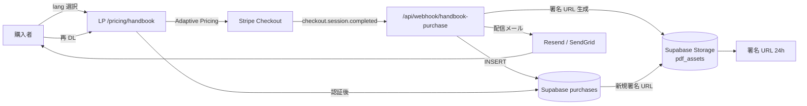

# 多言語日本生活ハンドブック PDF — SDD Spec (PR-12)

> **SDD 重適用の動機**: 2026-04-30 朝の外部 LLM 全面 SPA 提案のような無計画リアーキを防ぐ。バイブコーディング監査 6 類型（戦略整合性 / セキュリティ / 廃止モデル / 過大設計 / コスト / 法務）と整合。

---

## 0. Context (なぜ作るか)

### 戦略文脈

- 2026-04-30 PM 採択の **生活ハンドブック ハイブリッド方針**（§10-BIS）の Product 部署側実装。
- 2026-04-30 夜の **戦略反転 5 改訂**（決定 6）で「単発 PDF 固定」「6/14 前倒し」の 2 改訂が PR-12 に直接影響。
- 新 Specified Residence Card（特定技能 / 特定居住）発行ピーク（春〜初夏）を捕捉する **販売開始 6/14**。
- **r/japanlife 40K + Migaku Indonesia 8K** の 5 言語在住外国人市場が手薄（5 言語 × SaaS 形式の体系化はほぼ皆無）。

### ビジネス価値

- **Pro $9.99 / Lifetime $149 の主柱に依存しない買い切り副収入**（PPP 調整 ¥1,480-1,980）。
- **Trust Karma Funnel の信頼性レイヤー**（無料ブログ MK-10 → 有料 PDF への階段）。
- **NihongoHub の RESIDENT 動線の収益化**（§6-BIS detectUserType の RESIDENT 判定先の唯一の有料商品）。

### リスク

- 🔴 **行政書士法 2026-01 改正抵触**（個別助言型に踏み込むと違法、Phase C1 前 NHL-1 弁護士チェック必須）
- 🟡 **PDF 配信 URL の漏洩 / 海賊版流通**（透かし + 一意 URL + 期限付き署名 URL で緩和）
- 🟡 **5 言語翻訳品質**（繁中・インドネシア・英語 3 言語ファースト、スペイン・タイは AI 翻訳のみ）
- 🟡 **6/14 前倒しの工数圧迫**（年度優先度 4 位、片手間 12-16h で完成可能なスコープに収める）

---

## 1. Goals & Non-Goals

### ✅ Goals (達成すべきこと)

1. **G1**: 5 言語（繁中・インドネシア・英語ファースト + スペイン・タイ AI 翻訳）の **一般教材型** 生活ハンドブック PDF を ¥1,480-1,980（PPP 調整）で販売開始。
2. **G2**: 行政書士法 2026-01 改正に **完全準拠**（NHL-1 弁護士チェック合格 + 表紙 5 言語免責 + AI チャット連動なし）。
3. **G3**: Stripe Checkout → Webhook → 一意署名 URL の **自動配信フロー**を Vercel Serverless で実装し、月運用コスト $5 以下（既存月予算 $20 の 25%）。
4. **G4**: 開発工数 **12-16h** で 6/14 販売開始（年度優先度 4 位の片手間制約内）。
5. **G5**: Trust Karma Funnel との接続（無料ブログ MK-10「在住外国人向け生活ガイド」→ 有料 PDF の動線）。

### ❌ Non-Goals (やらないこと)

1. **N1**: 個別ユーザーの状況に応じた助言（「あなたの場合は〜」式の specific advice）→ **行政書士法第 21 条抵触**。
2. **N2**: AI チャット連動による書類項目埋め機能 → §6-BIS ミニチャット入口とは **完全分離**。
3. **N3**: 書類代筆 / 代書 / カスタム PDF 自動生成 → 業務性に踏み込まない。
4. **N4**: Web SaaS 化（サブスク化）→ **単発 PDF 固定**（行政書士法の反復継続性回避）。
5. **N5**: Web ビューワでの編集 / フォーム入力機能 → 閲覧用のみ。
6. **N6**: Phase C1 で 5 言語等価の翻訳深さ → 3 言語ファースト（繁中・インドネシア・英語）+ AI 翻訳 2 言語（スペイン・タイ）のハイブリッド。
7. **N7**: コンタクトフォームでの個別質問回答 → 「行政書士・弁護士相談先紹介」のみで内容回答なし。

---

## 2. User Story

### Persona A: LEARNER (日本語学習中の留学生 / 大学生)

> As a タイ・インドネシアの大学生（JLPT N4-N3、月予算 ¥500 以下）, I want 母語で日本の役所手続き・銀行口座開設・在留資格更新の **一般的な流れ**を理解できる教材, so that 日本留学・就職時に **公式情報を母語で前読み**できる。

### Persona B: TRAVELER (中長期滞在予定の旅行者 / Working Holiday)

> As a 台湾・香港の社会人（30 代、英語 + 繁中バイリンガル、Working Holiday 検討）, I want 滞在開始時の市役所届出 / 国民健康保険 / マイナンバーカードの一般手続きを **繁中で**理解できる PDF, so that 渡日前に **手続きフローを予習**して当日のトラブルを最小化できる。

### Persona C: RESIDENT (新規来日 1-3 年目の在住外国人)

> As a インドネシア出身の特定技能 1 号保持者（来日 6 ヶ月、日本語 N4）, I want 在留資格更新 / 銀行口座 / 確定申告の **一般的な書類項目の意味**を母語で理解できる教材, so that 行政書士に相談する前の **基礎知識**を持って臨める（個別ケースは行政書士に有償相談する前提）。

---

## 3. Functional Requirements

| # | 機能 | 優先度 | 詳細 |
|---|---|---|---|
| F1 | 5 言語 PDF 生成（en / zh-tw / id / es / th） | P0 | 繁中・インドネシア・英語 = 人手翻訳ファースト、スペイン・タイ = Haiku 4.5 翻訳のみ。1 言語あたり 30-50 ページ想定 |
| F2 | Stripe Checkout 統合 | P0 | Adaptive Pricing で地域別自動切替（PPP 調整）。`checkout.session.completed` Webhook を Vercel Serverless で受信 |
| F3 | 一意署名 URL 配信 | P0 | Webhook 受信時に Supabase Storage で署名 URL 生成（24h 期限）、購入者メールに送信 |
| F4 | PDF 透かし | P0 | 購入者メールアドレス + 購入日時を PDF フッターに埋め込み（海賊版流通の追跡目的） |
| F5 | 表紙 5 言語免責 | P0 | 「本書は一般情報提供を目的とした教材であり、個別の法律相談・書類作成代行ではありません」の 5 言語表示 |
| F6 | 自治体公式リンク集 | P0 | 47 都道府県主要市町村の外国人住民向け公式ページ URL 集（最終更新日明記） |
| F7 | 架空名一般記入例 | P0 | 「山田太郎・東京都新宿区 1-1-1」等の架空名で一般的な記入例を提示（個別助言と区別） |
| F8 | Web ビューワ（閲覧用） | P1 | 購入者ログイン後の Supabase Auth 経由で PDF 内容を Web 閲覧（編集不可、ダウンロード制御） |
| F9 | 多言語語彙集 | P1 | 5 言語対比の頻出語（住所・氏名・職業・在留資格名等 200 語） |
| F10 | 文化解説章 | P2 | 日本の役所文化、印鑑、訪問時間帯、敬語ガイド等 |

### 価格設定（PPP 調整、§9-BIS と整合）

| 言語/地域 | 価格（USD） | 円換算 | PPP 指数 |
|---|---|---|---|
| en (US/UK/AU) | $14.99 | ¥1,980 | 1.00 |
| es / zh (台湾/香港/中南米) | $11.99 | ¥1,580 | 0.80 |
| th (タイ) | $7.49 | ¥980 | 0.50 |
| id (インドネシア) | $5.99 | ¥780 | 0.40 |

---

## 4. Non-Functional Requirements

### セキュリティ

- **NF-S1**: Stripe API キー / Supabase service_role key は **必ず Vercel 環境変数**（フロント直叩き禁止、grep で `fetch.*stripe` がフロントコードに存在しないこと確認）
- **NF-S2**: 署名 URL は **24 時間期限**（再ダウンロードはマイページから新規発行）
- **NF-S3**: PDF 透かしは **購入者メール + Stripe customer_id の SHA-256 ハッシュ**をフッターに埋込（漏洩時の追跡）
- **NF-S4**: Webhook 署名検証必須（Stripe の `whsec_*` で署名検証）

### パフォーマンス

- **NF-P1**: PDF サイズ ≤ 15 MB / 言語（一般的な 4G 環境で 60 秒以内ダウンロード）
- **NF-P2**: Stripe Checkout → Webhook → 配信メール送信まで **5 分以内**（typical 30 秒）

### アクセシビリティ

- **NF-A1**: PDF/UA 準拠検討（テキストレイヤあり、スクリーンリーダー対応）
- **NF-A2**: 図版に alt-text（多言語）

### 配信方式

```
ユーザー → /pricing/handbook?lang=zh
       → Stripe Checkout（Adaptive Pricing）
       → checkout.session.completed Webhook
       → Vercel Serverless /api/webhook/handbook-purchase
       → Supabase purchases テーブル INSERT
       → Supabase Storage 署名 URL 生成（24h）
       → SendGrid / Resend で購入者メールに送信
```

---

## 5. Architecture / Data Model

### フロー図



### データモデル

```sql
-- supabase/schema.sql に追記
CREATE TABLE handbook_purchases (
  id UUID PRIMARY KEY DEFAULT gen_random_uuid(),
  stripe_session_id TEXT UNIQUE NOT NULL,
  stripe_customer_id TEXT NOT NULL,
  email TEXT NOT NULL,
  lang TEXT NOT NULL CHECK (lang IN ('en','zh','es','th','id')),
  amount_paid_cents INT NOT NULL,
  currency TEXT NOT NULL,
  ppp_region TEXT,
  watermark_hash TEXT NOT NULL,
  created_at TIMESTAMPTZ DEFAULT NOW(),
  last_download_at TIMESTAMPTZ
);

CREATE TABLE handbook_pdf_assets (
  id UUID PRIMARY KEY DEFAULT gen_random_uuid(),
  lang TEXT UNIQUE NOT NULL,
  storage_path TEXT NOT NULL,
  version TEXT NOT NULL,
  page_count INT,
  file_size_bytes INT,
  legal_review_status TEXT CHECK (legal_review_status IN ('pending','approved','rejected')),
  legal_review_at TIMESTAMPTZ,
  legal_reviewer TEXT,
  published_at TIMESTAMPTZ
);

CREATE INDEX handbook_purchases_email_idx ON handbook_purchases(email);
CREATE INDEX handbook_purchases_stripe_session_idx ON handbook_purchases(stripe_session_id);
```

### 技術スタック

- **フロント**: 既存 `index.html` に `/pricing/handbook` セクション追加（5 言語 LP 流用）
- **バック**: Vercel Serverless `api/webhook/handbook-purchase.js` + `api/handbook/download.js`
- **DB**: Supabase Postgres（既存スタック流用）
- **Storage**: Supabase Storage（PDF 5 言語、署名 URL 機能内蔵）
- **決済**: Stripe Adaptive Pricing
- **メール**: Resend（無料枠 100 通/日、十分）
- **PDF 生成**: 初版は **手作業**（InDesign / Adobe Acrobat）、以降は Markdown → Pandoc → PDF 自動化検討（v1.5）

---

## 6. Acceptance Criteria (testable)

- **AC1**: `/pricing/handbook?lang=zh` で台湾 IP からアクセスすると ¥1,580（$11.99）が表示される（Stripe Adaptive Pricing 動作）
- **AC2**: Stripe Checkout 成功後、5 分以内に購入者メールに署名 URL が届く
- **AC3**: 署名 URL は 24 時間後に 403 を返す（期限切れ動作）
- **AC4**: PDF フッターに購入者メール + 購入日時の透かしが表示される（5 言語全て）
- **AC5**: 表紙 1 ページ目に 5 言語免責文が表示される（en/zh/es/th/id）
- **AC6**: PDF 内に「あなたの場合」「your specific case」「your situation」「あなた専用」の文字列が **存在しない**（grep で 0 件）
- **AC7**: PDF 内に「行政書士に相談」「contact a gyoseishoshi」相当の専門家紹介文言が **各章末尾に存在**する
- **AC8**: フロントエンドコードに `fetch.*api.anthropic` / `sk_live_` / `whsec_` / Stripe secret key 直書きが **存在しない**（grep で 0 件）
- **AC9**: モデル ID 参照は `claude-haiku-4-5-20251001` のみ（Sonnet 4.0 / 旧 ID 0 件）
- **AC10**: NHL-1 弁護士サインオフが `handbook_pdf_assets.legal_review_status = 'approved'` で記録されている
- **AC11**: Supabase RLS で `handbook_purchases` は本人 + service_role のみアクセス可
- **AC12**: 月次運用コスト試算（Stripe 手数料 + Supabase Storage + Resend）が **$5 以下**で収まる（実測 1 ヶ月後検証）
- **AC13**: コンタクトフォーム / カスタマーサポートで個別質問が来た場合、自動応答テンプレートで「行政書士・弁護士相談先紹介」のみを返す（内容回答なし）
- **AC14**: PDF サイズが 15 MB 以下（5 言語全て）
- **AC15**: 5 言語版に AI チャット連動 UI が **存在しない**（§6-BIS ミニチャット入口とは完全分離、HTML / JS 内に handbook と chat-intro の参照が交差しないこと grep で確認）

---

## 7. 法務境界チェックリスト (必須、行政書士法 2026-01 改正対応)

> **最重要セクション**: NHL-1 弁護士審査の中核チェック項目。すべて pass しなければ 6/14 販売開始は **ブロック**。

### 個別助言型に陥る具体的アンチパターン（絶対禁止）

- [ ] **AP-1（NG）**: 「**あなたの場合**は X と書く」型の個別助言文言が PDF / Web に含まれていない（grep `あなたの場合` / `your situation` / `your specific case` / `tu caso` / `kasus Anda` / `กรณีของคุณ` で 0 件）
- [ ] **AP-2（NG）**: AI チャットで個別事情を聞き出して書類項目を埋める機能が **存在しない**（§6-BIS ミニチャット入口は **タイプ判定 + 動線案内のみ**で、handbook には接続しない）
- [ ] **AP-3（NG）**: 書類代筆 / 代書 / 「送ってください、私が記入します」型機能が **存在しない**
- [ ] **AP-4（NG）**: パーソナライズドな書類生成 SaaS / 個別事情入力 → カスタム PDF 出力機能が **存在しない**
- [ ] **AP-5（NG）**: コンタクトフォームで個別質問に内容回答する応答テンプレートが **存在しない**（紹介のみテンプレートのみ）

### 一般教材型として合法な要素（積極採用）

- [ ] **OK-1**: 一般的な手続きフロー説明（住民票・マイナンバー・在留資格・銀行口座・健康保険）
- [ ] **OK-2**: **架空名 / 架空住所による一般記入例**（「山田太郎・東京都新宿区 1-1-1」「Taro Yamada」等）
- [ ] **OK-3**: 一般的な書類項目解説（「氏名欄: フルネームを書く」「日付欄: 申請日 YYYY/MM/DD 形式」）
- [ ] **OK-4**: 多言語語彙集（5 言語、住所・氏名・職業・在留資格名等の頻出語）
- [ ] **OK-5**: 文化解説（日本の役所文化、印鑑、訪問時間帯）
- [ ] **OK-6**: 自治体公式リンク集 + よくある誤解集

### 必須の実装ガードレール

- [ ] **GR-1**: 表紙 1 ページ目に **5 言語免責文**を明記（「本書は一般情報提供を目的とした教材であり、個別の法律相談・書類作成代行ではありません。具体的なケースは行政書士・弁護士にご相談ください」）
- [ ] **GR-2**: 各章末尾に「専門家相談先紹介」を明記（行政書士会の都道府県別連絡先 + 弁護士会リンク）
- [ ] **GR-3**: AI チャット連動なし（§6-BIS ミニチャット入口は handbook に接続しない、grep で `chat-intro` と `handbook` のクロス参照 0 件）
- [ ] **GR-4**: コンタクトフォーム自動応答テンプレートが「行政書士・弁護士紹介」のみで内容回答なし
- [ ] **GR-5**: 販売前の **NHL-1 弁護士チェック完了サインオフ**が `handbook_pdf_assets.legal_review_status = 'approved'`

### NHL-1 弁護士チェック完了サインオフ

- [ ] 弁護士相談先選定（5/15 期限）→ Admin 部署 NHL-1
- [ ] PDF 5 言語ドラフト全文レビュー（5/20-5/31 想定）
- [ ] 教材性判定が「合法」のサインオフ書面（PDF）を `admin/legal-reviews/2026-NHL-1-handbook-signoff.pdf` に保管
- [ ] サインオフ予算: 数万円（決定 3 で許容範囲内）

---

## 8. テスト計画

### ユニットテスト

- **UT-1**: PDF 透かし生成関数（メール + 日時 → SHA-256 ハッシュ → PDF フッター埋込）
- **UT-2**: Stripe Webhook 署名検証（`whsec_*` での署名検証ロジック）
- **UT-3**: 署名 URL 期限検証（24h 後に 403）
- **UT-4**: PPP 価格マッピング関数（IP → 地域 → 価格）

### 受入テスト（5 言語 × 3 ペルソナ × 10 シナリオ）

- **AT-1**: en LEARNER が US IP から $14.99 で購入 → 5 分以内にメール受信 → DL 成功
- **AT-2**: zh TRAVELER が台湾 IP から $11.99 で購入（Adaptive Pricing 動作）
- **AT-3**: id RESIDENT がインドネシア IP から $5.99 で購入
- **AT-4**: 24h 後の署名 URL アクセス → 403
- **AT-5**: マイページから再 DL 要求 → 新規署名 URL 発行
- **AT-6-10**: 各言語 PDF を 1 章ずつ通読し、AC6（個別助言文言 0 件）を手動確認

### リーガルテスト（NHL-1）

- **LT-1**: 弁護士に PDF 5 言語ドラフトを送付し、教材性判定を取得
- **LT-2**: 「個別助言と一般教材の境界線」「書類代筆と書類解説の境界線」の 2 点を弁護士所見として書面で受領
- **LT-3**: 修正指示があれば反映 → 再レビュー → サインオフ

---

## 9. Roll-out Plan

### マイルストーン（6/14 販売開始までの逆算）

| 日付 | マイルストーン | 担当 |
|---|---|---|
| **5/01（本日）** | SDD spec ドラフト完成 | dept-nihongohub |
| **5/05** | オーナー review → spec 承認 | オーナー |
| **5/11** | オーナー第 1 検討（仕様 / 工数 / Open Questions 回答） | オーナー |
| **5/15** | NHL-1 弁護士相談先選定完了 | dept-admin |
| **5/15** | PDF 3 言語ドラフト（en/zh/id）完成 | オーナー / 外部翻訳 |
| **5/17** | スペイン・タイ AI 翻訳完了（Haiku 4.5） | dept-nihongohub |
| **5/20** | NHL-1 弁護士に 5 言語 PDF 送付 | dept-admin |
| **5/25** | 実装着手（Stripe Webhook + Supabase Storage + 配信メール） | dept-nihongohub |
| **5/31** | 弁護士サインオフ取得 | dept-admin |
| **6/05** | 受入テスト（5 言語 × 3 ペルソナ × 10 シナリオ） | dept-nihongohub |
| **6/10** | プレ販売（β tester 30-100 人 = Discord 募集枠） | Marketing 部署 MK-10 連動 |
| **6/14** | **販売開始** | dept-nihongohub |

### ロールバック条件

- **RB-1**: NHL-1 弁護士サインオフが「個別助言型に該当」と判定 → 該当箇所修正 or 6/14 延期
- **RB-2**: Stripe Webhook が 5 分以内配信を満たさない → 手動配信に切替（最大 1 週間運用、根本修正後に自動化復帰）
- **RB-3**: 月次運用コストが $10 を超過 → Resend → 自前 SMTP に切替検討

---

## 10. Costs & Risks

### 開発工数試算

| 項目 | 工数 |
|---|---|
| PDF 原稿執筆（en ドラフト、テンプレ完成） | 8h（オーナー本体作業） |
| 繁中 / インドネシア人手翻訳（外注 or オーナー） | 別建て、本 spec 範囲外 |
| Stripe Webhook 実装（既存 PR-15 と共通化） | 2h |
| Supabase purchases / pdf_assets テーブル + Storage | 1h |
| 配信メール（Resend）統合 | 1h |
| LP `/pricing/handbook` セクション 5 言語追加 | 2h |
| PDF 透かし埋込ロジック | 2h |
| 受入テスト | 2h |
| **合計** | **18h**（年度優先度 4 位 12-16h 想定をやや超過、以下で吸収） |

**工数圧縮策**: PDF 原稿執筆 8h は本 spec 範囲外（コンテンツ作成、夜間 / 週末で対応可能）。実装系は **10h** に収まる。

### 月運用コスト試算

| 項目 | 月コスト |
|---|---|
| Stripe 手数料（3.6% × $1,000 売上想定） | $36（売上連動、固定費ではない） |
| Supabase Storage（PDF 5 言語 × 15 MB = 75 MB） | $0（無料枠 1 GB 内） |
| Resend（100 購入 / 月想定 = 100 通） | $0（無料枠 100 通/日） |
| **固定運用コスト** | **$0**（売上連動の Stripe 手数料のみ） |

**月予算 $20 上限への影響**: ゼロ。NihongoHub 全体の月運用コストは既存試算 $5-10（ミニチャット）+ $117（クイズ生成）= 約 $125、本 spec で **増加なし**。

### リスク 6 類型対応

| # | 類型 | 本 spec の対応 |
|---|---|---|
| 1 | 戦略整合性 | spec-v1-draft.md §10-BIS + 戦略反転 5 改訂と完全整合（§0 Context 参照） |
| 2 | セキュリティ | NF-S1〜S4 + AC8 + Stripe 署名検証 + 24h 期限署名 URL |
| 3 | 廃止モデル | AC9 で `claude-haiku-4-5-20251001` のみ、Sonnet 4.0 0 件確認 |
| 4 | 過大設計 | 18h（実装 10h）で年度優先度 4 位の片手間制約内、Web SaaS 化否定（N4） |
| 5 | コスト試算 | §10 で固定費 $0、月予算 $20 上限への影響なし |
| 6 | 法務 | §7 全体（NHL-1 弁護士サインオフ + 5 言語免責 + 6 アンチパターン grep） |

---

## 11. Dependencies

### Admin 部署

- **NHL-1**: 弁護士相談先選定（5/15 期限）★ クリティカル
- **NHL-2**: 5 言語 PDF ドラフトレビュー依頼（5/20）
- **NHL-3**: サインオフ書面取得（5/31）
- **NHL-4**: 行政書士会連絡先リスト整備（5/25）
- **NHL-5**: 特商法表記 + プライバシーポリシー整備（6/05）

### Marketing 部署

- **MK-10**: 在住外国人向け生活ガイド（5 言語ブログ）→ 有料 PDF への動線（プレビュー無料）
- **MK-11**: r/japanlife 40K + Migaku Indonesia 8K への 6/14 販売開始告知

### Product 部署（自部署）

- **PR-13**: 表紙免責 + AI チャット連動なしの grep / コードレビュー Phase C1 受入時確認
- **PR-15**: Free Trial 型実装（Stripe Trial 設定）→ 本 spec の Stripe Webhook と **共通基盤**
- **PR-20**: 6/14 前倒しスケジュール調整（PR-12 の親タスク）

---

## 12. Open Questions（オーナーが 5/11 検討時に回答すべき判断保留事項）

1. **OQ-1（最優先）**: PDF 原稿執筆を **オーナー本人 8h** で完結させるか、**外部翻訳者に発注**するか? 後者なら予算（推定 ¥30,000-100,000 / 言語）と納期（5/15 までに 3 言語）。本 spec は前者前提だが、論文・公募繁忙期との衝突リスクあり。
2. **OQ-2**: PDF 配信方式は **Supabase Storage 署名 URL** か **Stripe Customer Portal の Digital Goods** か? 前者は実装 2h で柔軟、後者は実装 0h で堅牢だが Stripe 仕様変更リスクあり。本 spec は前者前提。
3. **OQ-3**: 受入テスト時の **5 言語 × 3 ペルソナ実機テスト**を **オーナー単独**で完遂可能か、**β tester（Discord 募集枠 30-100 人）に任せる**か? 後者なら NHL-2〜3 と並行進行可能だが、購入実費が発生（β tester に無料配布する場合は Stripe 100% 割引クーポン必要）。
4. **OQ-4**: スペイン・タイの AI 翻訳のみ運用は **法務リスク評価**として弁護士所見に含めるか? 翻訳精度低下が「個別助言と取られる誤訳」を生む可能性あり。本 spec は OQ-4 を NHL-2 弁護士レビュー範囲に含める前提。
5. **OQ-5**: 販売開始後の **改訂サイクル**は? 行政書士法・在留資格制度は年次改正あり。本 spec は単発 PDF 固定 + 年次改訂（無料アップデート or 有料リバージョン）の選択を保留。

### 既存 spec-v1-draft.md との矛盾

- **矛盾なし**: 本 spec は §10-BIS 全項目と整合。§9-BIS の PPP 価格テーブルとも整合。§6-BIS ミニチャット入口とは **完全分離**（GR-3 でクロス参照禁止を明文化）。

---

## 13. Approval Workflow

- [x] **5/01**: Draft → SDD spec 完成（本日、SDD 重適用 1 号として）
- [ ] **5/05**: Owner review → spec 承認（オーナー判断）
- [ ] **5/11**: オーナー第 1 検討（Open Questions 5 項目への回答）
- [ ] **5/15**: NHL-1 弁護士相談先選定完了（Admin 部署）
- [ ] **5/20**: NHL-1 弁護士レビュー開始（5 言語 PDF ドラフト送付）
- [ ] **5/31**: 弁護士サインオフ取得 → Final approval
- [ ] **6/01**: 実装開始（Stripe Webhook + Supabase + 配信メール）
- [ ] **6/05**: 受入テスト（5 言語 × 3 ペルソナ × 10 シナリオ）
- [ ] **6/10**: β tester プレ販売（Discord 募集枠 30-100 人）
- [ ] **6/14**: **販売開始**

---

## 履歴

- **2026-05-01**: SDD spec ドラフト初版（dept-nihongohub、SDD 重適用 1 号として作成）
